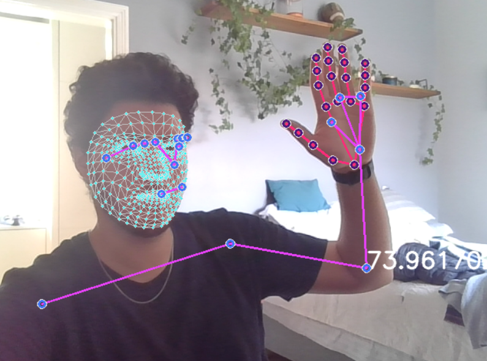

# Computer-Vision-Tracking

This  project uses the MediaPipe Holistic Tracking Algorithm to track a human's elbow in real-time video and then calculates the angle formed by the upper arm and the forearm using OpenCV. The algorithm is designed to work with standard video input from cameras, and can be used in a wide range of applications, including biomechanics research, physical therapy, and human-computer interaction. 

### Video Output
 